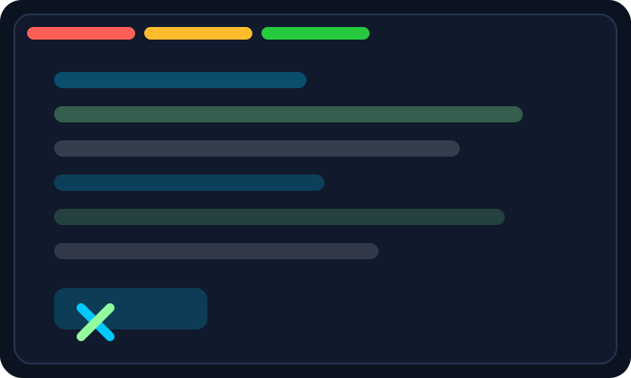
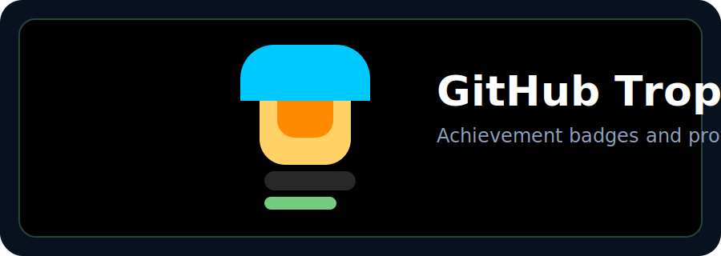
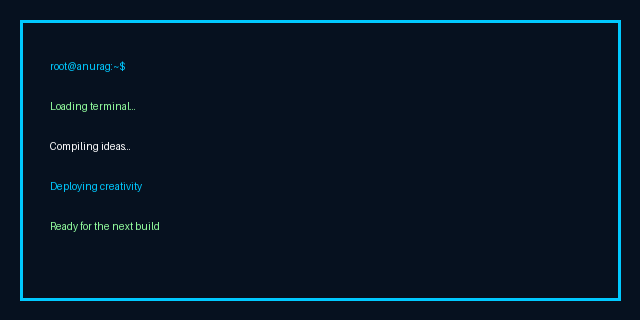

<p align="center">
  
</p>

<p align="center">
  
</p>

<p align="center">

</p>

<h2 align="center">👋 Welcome to my GitHub</h2>

<p align="center">
Building modern web applications while exploring AI, backend engineering and scalable software.
</p>

<p align="center">
  
</p>

---

# 💻 About Me

```javascript
const anurag = {
  name: "Anurag Chandra",
  username: "anuragchandr",
  location: "Bihar, India",
  education: "B.Tech ECE @ NIT Patna",

  role: "Full Stack Developer",

  currentlyLearning: [
    "Next.js",
    "Backend Development",
    "AI / ML",
    "System Design"
  ],

  tech: {
    frontend: ["React","Next.js","HTML","CSS","JavaScript","TypeScript"],
    backend: ["Node.js","Express"],
    database: ["MongoDB","Redis"],
    languages: ["C++","Python","JavaScript"],
    tools: ["Git","GitHub","VS Code","Docker","Linux"]
  },

  motto: "Learn • Build • Improve"
}
```

---

# ⚙️ Tech Stack

<p align="center">

</p>

---

# 📊 GitHub Stats

<p align="center">


</p>

<p align="center">

</p>

---

# 🏆 Trophies

<p align="center">

</p>

---

# 📈 Activity Graph

<p align="center">

</p>

---

# 🐍 Contribution Snake

<p align="center">
  
</p>

> Generated automatically by the `snake.yml` workflow in `.github/workflows/` — runs on a schedule via GitHub Actions and commits the SVG to an `output` branch.

---

# ✨ Random Dev Quote

<p align="center">

</p>

---

<p align="center">
  
</p>

<p align="center">

</p>

<p align="center">

</p>